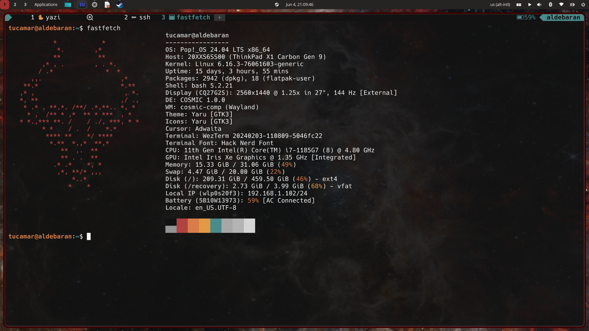
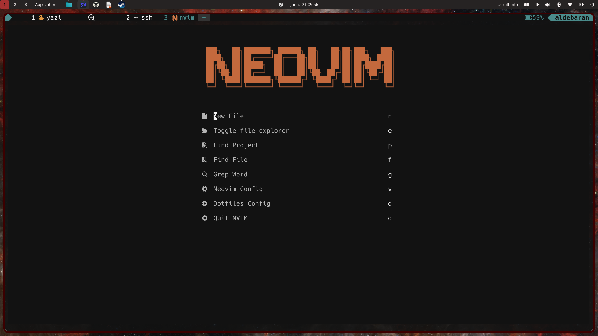

# Dotfiles

A personal collection of Linux desktop and terminal configuration files, organized with GNU Stow.

## Overview

This repository keeps my shell, editor, terminal, and desktop configuration in one place so I can reproduce the same environment on a new machine with minimal effort. Each tool lives in its own package and is symlinked into the right location with Stow.

### fastfetch
Place your fastfetch screenshot in the repository and reference it here.

```md

```

### alpha.nvim
Place your alpha.nvim screenshot in the repository and reference it here.

```md

```

## Managed with GNU Stow

GNU Stow is the backbone of this setup. Instead of copying files manually into `$HOME`, each configuration is stored in a dedicated directory and linked where it belongs.

```bash
git clone <your-repo-url> ~/.dotfiles
cd ~/.dotfiles
stow bash git nvim wezterm yazi bat lsd fastfetch
```

To remove a package:

```bash
stow -D nvim
```

## Tools

### Bash
Bash provides the core shell environment for aliases, environment variables, prompt behavior, and day-to-day terminal workflow.

### Neovim
Neovim is the main editor in this setup. It is configured as a fast and extensible development environment for editing code, text, and configuration files.

### WezTerm
WezTerm is a GPU-accelerated terminal emulator used for a modern terminal experience. It handles appearance, tabs, keybindings, and integrates well with terminal-centric workflows.

### Yazi
Yazi is a fast terminal file manager with keyboard-driven navigation. It makes browsing, previewing, and managing files easier without leaving the terminal.

### fastfetch
fastfetch displays system information in a clean and customizable way. It is useful for quickly checking the machine setup and for giving the terminal a polished startup view.

### bat
bat is a modern replacement for `cat` with syntax highlighting, line numbers, and Git-aware output.

### lsd
lsd is a modern replacement for `ls`, adding colors, icons, and improved defaults for directory listings.

### zoxide
zoxide is a smarter alternative to `cd`. It learns frequently used paths and makes jumping between projects much faster.

### Git
Git configuration stores aliases, preferences, and workflow tweaks for version control.

### readline / inputrc
These settings improve shell editing, keybindings, and command-line behavior.

### Fonts
Local fonts are included to support terminal icons, editor themes, and a more consistent UI.

### Wallpapers
A small collection of wallpapers used in the desktop setup.

## Rust CLI suite

Part of this environment is built around modern Rust-based tools:

- `lsd` for directory listings (ls alternative)
- `fd` for file and directory searching (find alternative) (love this one)
- `ripgrep` for recursive string searching (grep alternative)
- `sd` for replacement (sed alternative)
- `zoxide` for smart directory jumping (cd alternative)
- `bat` for file previewing (cat alternative)
- `yazi` for file management
- `fastfetch` for system information display

Together, they form a lightweight Rust-powered command-line suite focused on speed, usability, and better terminal ergonomics.

## Repository layout

- `bash/`
- `bash/.config`
- `bat/.config/bat/`
- `fastfetch/.config/fastfetch/`
- `fonts/.local/share/fonts/`
- `git/.config/git/`
- `inputrc/.config/readline/`
- `lsd/.config/lsd/`
- `nvim/.config/nvim/`
- `wezterm/.config/wezterm/`
- `yazi/.config/yazi/`
- `wallpapers/`

## Notes

These dotfiles are personal and opinionated, but structured to be easy to maintain, extend, and deploy across machines.
